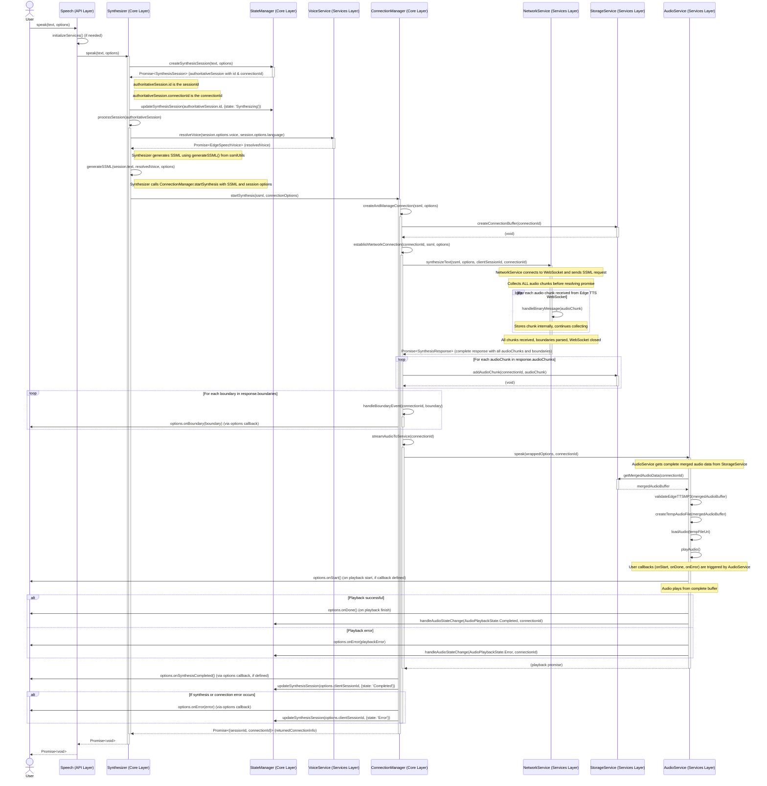

# Speech.speak() Workflow Documentation

This document provides a comprehensive overview of the `Speech.speak()` method execution flow in expo-edge-speech, detailing the complete text-to-speech synthesis process from user call to audio playback.

## Overview

The `Speech.speak()` method orchestrates a sophisticated text-to-speech synthesis process using Microsoft Edge TTS, implemented with a **batch processing architecture** that ensures reliable audio delivery through complete synthesis before playback.

### Architecture Layers

expo-edge-speech follows a clean 3-layer architecture:

- **🎯 API Layer**: `Speech` - User-facing interface with input validation
- **⚙️ Core Layer**: `Synthesizer`, `ConnectionManager`, `StateManager` - Business logic coordination
- **🔧 Services Layer**: `NetworkService`, `AudioService`, `StorageService`, `VoiceService` - Specialized functionality

### Key Design Principles

- **🔄 Batch Processing**: Complete synthesis before playback for reliability
- **🎯 Session Management**: Unique session tracking for each synthesis request
- **🛡️ Error Recovery**: Circuit breaker patterns and retry mechanisms
- **📱 Platform Optimization**: Native audio integration via expo-av
- **⚡ Resource Management**: Efficient memory and connection handling

## Synthesis Workflow Overview

```typescript
// User initiates synthesis
await Speech.speak("Hello, world!", {
  voice: 'en-US-AriaNeural',
  rate: 1.0,
  onStart: () => console.log('Playback started'),
  onDone: () => console.log('Synthesis complete'),
  onBoundary: (boundary) => console.log('Word:', boundary),
  onError: (error) => console.error('Error:', error)
});
```

### Process Flow

1. **🔍 Input Validation & Service Initialization**
2. **📝 Session Creation & SSML Generation** 
3. **🌐 Edge TTS Communication & Audio Synthesis**
4. **💾 Complete Audio Collection & Storage**
5. **🎵 Audio Validation & Playback**
6. **🧹 Resource Cleanup & Session Completion**

## Detailed Workflow Sequence

### Phase 1: Initialization & Validation

```typescript
// 1. User calls Speech.speak()
Speech.speak(text, options)
  ↓
// 2. Input validation and service initialization
Speech.initializeServices() // Lazy initialization on first call
  ↓
// 3. Delegate to Synthesizer
Synthesizer.speak(text, options)
```

**Service Initialization Details:**
- **Lazy Loading**: Services initialize only on first `speak()` call
- **Configuration Locking**: Prevents configuration changes after initialization
- **Dependency Order**: StorageService → AudioService → NetworkService → VoiceService → StateManager → ConnectionManager → Synthesizer
- **Error Prevention**: Failed initialization throws detailed errors

### Phase 2: Session Management & SSML Generation

```typescript
// 4. Create synthesis session
StateManager.createSynthesisSession(text, options)
  ↓
// Returns: { id: sessionId, connectionId: uniqueConnectionId }
// 5. Update session state
StateManager.updateSynthesisSession(sessionId, { state: 'Synthesizing' })
  ↓
// 6. Voice resolution
VoiceService.resolveVoice(options.voice, options.language)
  ↓
// 7. SSML generation
Synthesizer.generateSSML(text, resolvedVoice, options)
```

**Session Management Features:**
- **Unique Session IDs**: Each synthesis gets isolated session tracking
- **Connection ID Mapping**: Links sessions to specific Edge TTS connections
- **State Tracking**: Monitors synthesis progress through completion
- **Concurrent Support**: Multiple simultaneous synthesis sessions

### Phase 3: Network Communication & Synthesis

```typescript
// 8. Initiate synthesis
ConnectionManager.startSynthesis(ssml, connectionOptions)
  ↓
// 9. Connection management
ConnectionManager.establishNetworkConnection(connectionId, ssml, options)
  ↓
// 10. Edge TTS communication
NetworkService.synthesizeText(ssml, options, sessionId, connectionId)
```

**Network Communication Process:**

```typescript
// NetworkService handles complete Edge TTS protocol
class NetworkService {
  async synthesizeText(ssml, options, sessionId, connectionId) {
    // 1. Establish WebSocket connection to Edge TTS
    const connection = await this.createEdgeTTSConnection();
    
    // 2. Send configuration and SSML
    await this.sendConfiguration(connection);
    await this.sendSSMLRequest(connection, ssml);
    
    // 3. Collect ALL audio chunks (batch processing)
    const audioChunks = [];
    const boundaries = [];
    
    for await (const message of connection) {
      if (message.type === 'audio') {
        audioChunks.push(message.data);
      } else if (message.type === 'boundary') {
        boundaries.push(this.parseBoundary(message));
      }
    }
    
    // 4. Return complete response only after all data collected
    return { audioChunks, boundaries };
  }
}
```

### Phase 4: Audio Processing & Storage

```typescript
// 11. Process complete synthesis response
ConnectionManager receives SynthesisResponse { audioChunks[], boundaries[] }
  ↓
// 12. Store all audio chunks
for (const chunk of response.audioChunks) {
  StorageService.addAudioChunk(connectionId, chunk);
}
  ↓
// 13. Process word boundaries
for (const boundary of response.boundaries) {
  options.onBoundary?.(boundary); // Trigger user callback
}
  ↓
// 14. Prepare for playback
ConnectionManager.streamAudioToService(connectionId)
```

**Storage Management:**
- **Connection-Scoped Buffers**: Each synthesis gets isolated storage
- **Memory Management**: Configurable buffer limits with cleanup
- **Data Integrity**: Complete audio validation before playback
- **Efficient Merging**: Optimized audio chunk concatenation

### Phase 5: Audio Playback

```typescript
// 15. Audio service handles playback
AudioService.speak(wrappedOptions, connectionId)
  ↓
// 16. Get complete audio buffer
const audioBuffer = StorageService.getMergedAudioData(connectionId);
  ↓
// 17. Validate and prepare audio
AudioService.validateEdgeTTSMP3(audioBuffer);
const tempFile = AudioService.createTempAudioFile(audioBuffer);
  ↓
// 18. Load and play audio
const audioPlayer = await AudioService.loadAudio(tempFile);
await AudioService.playAudio(audioPlayer);
```

**Audio Playback Flow:**
- **Format Validation**: Ensures MP3 format integrity
- **Temporary File Creation**: Converts buffer to playable file
- **Expo AV Integration**: Uses native audio capabilities
- **Callback Coordination**: Triggers user callbacks at appropriate times

### Phase 6: Completion & Cleanup

```typescript
// 19. Playback lifecycle events
AudioService triggers:
  - options.onStart() // When playback begins
  - options.onDone()  // When playback completes successfully
  - options.onError() // If playback fails
  ↓
// 20. Update session state
StateManager.updateSynthesisSession(sessionId, { state: 'Completed' });
  ↓
// 21. Resource cleanup
StorageService.cleanupConnection(connectionId);
ConnectionManager.releaseConnection(connectionId);
```

## Technical Implementation Details

### Batch Processing Architecture

The implementation uses **batch processing** rather than streaming for optimal reliability:

**Benefits:**
- ✅ **Complete Validation**: Full audio synthesis verification before playback
- ✅ **Reliable Playback**: No interruptions or quality degradation
- ✅ **Error Prevention**: Issues detected before user impact
- ✅ **Predictable Performance**: Consistent timing and resource usage
- ✅ **Platform Compatibility**: Works reliably across iOS, Android, and Web

**Process Flow:**
1. **Complete Synthesis**: All audio chunks collected before proceeding
2. **Batch Storage**: Entire audio buffer stored and validated
3. **Single Playback**: One consolidated audio file played back
4. **Reliable Experience**: No partial audio or interruption risks

### Circuit Breaker Implementation

Protects against service failures and enables automatic recovery:

```typescript
// Circuit Breaker States
enum CircuitBreakerState {
  Closed,    // Normal operation - all requests proceed
  Open,      // Service failing - reject requests immediately  
  HalfOpen   // Testing recovery - allow limited test requests
}

class CircuitBreaker {
  private state = CircuitBreakerState.Closed;
  private failureCount = 0;
  private successCount = 0;
  
  async execute<T>(operation: () => Promise<T>): Promise<T> {
    if (this.state === CircuitBreakerState.Open) {
      if (this.shouldTestRecovery()) {
        this.state = CircuitBreakerState.HalfOpen;
      } else {
        throw new Error('Circuit breaker is open - service unavailable');
      }
    }
    
    try {
      const result = await operation();
      this.onSuccess();
      return result;
    } catch (error) {
      this.onFailure();
      throw error;
    }
  }
}
```

### Connection Management

Handles resource limits and connection pooling:

**Key Features:**
- **Connection Limits**: Configurable maximum concurrent connections
- **Pooling Strategy**: Optional connection reuse for improved performance
- **Resource Cleanup**: Automatic connection lifecycle management
- **App State Integration**: Proper handling during app backgrounding

**Configuration Options:**
```typescript
configure({
  connection: {
    maxConnections: 5,           // Maximum concurrent connections
    poolingEnabled: true,        // Enable connection reuse
    connectionTimeout: 10000,    // Connection establishment timeout
    circuitBreaker: {
      failureThreshold: 5,       // Failures before opening circuit
      recoveryTimeout: 30000,    // Time before testing recovery
      testRequestLimit: 3        // Successful tests to close circuit
    }
  }
});
```

### Error Handling & Recovery

Comprehensive error management throughout the synthesis pipeline:

**Error Categories:**
- **🌐 Network Errors**: Connection failures, timeouts (retryable)
- **🔐 Authentication Errors**: Service access issues (non-retryable)
- **💾 Resource Errors**: Memory, storage issues (context-dependent)
- **✅ Validation Errors**: Invalid SSML, format issues (non-retryable)

**Recovery Strategies:**
```typescript
// Error handling with automatic retry
async function synthesizeWithRetry(text: string, options: SpeechOptions) {
  const maxRetries = 3;
  let lastError: Error;
  
  for (let attempt = 1; attempt <= maxRetries; attempt++) {
    try {
      return await Speech.speak(text, options);
    } catch (error) {
      lastError = error;
      
      if (isRetryableError(error) && attempt < maxRetries) {
        const delay = calculateBackoffDelay(attempt);
        await sleep(delay);
        continue;
      }
      
      throw error;
    }
  }
}
```

### Memory Management

Efficient resource utilization with configurable limits:

**Storage Configuration:**
```typescript
configure({
  storage: {
    maxBufferSize: 16 * 1024 * 1024,  // 16MB maximum buffer
    cleanupInterval: 30000,            // 30 second cleanup cycle
    warningThreshold: 0.8              // 80% usage warning
  }
});
```

**Memory Patterns:**
- **Connection-Scoped**: Each synthesis gets isolated memory
- **Automatic Cleanup**: Periodic removal of completed sessions
- **Warning System**: Proactive memory usage monitoring
- **Graceful Degradation**: Configurable behavior when limits approached

## Performance Characteristics

### Timing Considerations

**Synthesis Phase:**
- Initial network connection: ~100-500ms
- SSML processing: ~50-200ms per 100 characters
- Audio synthesis: ~200-800ms per 100 characters
- Total synthesis time: Proportional to text length

**Playback Phase:**
- Audio validation: ~10-50ms
- File preparation: ~20-100ms
- Playback initiation: ~50-200ms
- Total playback latency: ~80-350ms

### Memory Usage Patterns

**Typical Usage:**
- Short text (1-50 words): 1-3MB audio buffer
- Medium text (50-200 words): 3-10MB audio buffer  
- Long text (200+ words): 10-30MB audio buffer

**Mobile Optimization:**
```typescript
// Mobile-optimized configuration
configure({
  connection: { maxConnections: 3 },      // Conservative mobile limits
  storage: { maxBufferSize: 8 * 1024 * 1024 }, // 8MB mobile limit
  network: { connectionTimeout: 8000 }     // Longer timeout for mobile
});
```

### Platform-Specific Considerations

**iOS:**
- Silent mode handling via `playsInSilentModeIOS`
- Background limitations (Expo Go restrictions)
- Audio session management via expo-av

**Android:**
- Audio ducking support via `shouldDuckAndroid`
- Background execution capabilities
- Earpiece routing options

**Web:**
- Browser connection limits
- Audio format compatibility
- Manual audio session control

## Troubleshooting Common Issues

### Synthesis Failures

**Network Issues:**
```typescript
// Check network connectivity
if (!navigator.onLine) {
  console.log('Device is offline - synthesis will fail');
}

// Configure longer timeouts for slow networks
configure({
  network: { connectionTimeout: 15000 }
});
```

**Voice Resolution Issues:**
```typescript
// Verify voice availability
const voices = await Speech.getAvailableVoicesAsync();
const isVoiceAvailable = voices.some(v => v.identifier === 'en-US-AriaNeural');

if (!isVoiceAvailable) {
  console.log('Requested voice not available - using default');
}
```

### Memory Issues

**Buffer Overflow:**
```typescript
// Monitor memory usage
configure({
  storage: {
    warningThreshold: 0.6,  // Early warning at 60%
    maxBufferSize: 8 * 1024 * 1024,  // Reduce limit for constrained devices
    cleanupInterval: 15000   // More frequent cleanup
  }
});
```

### Audio Playback Issues

**Platform Audio Configuration:**
```typescript
// Ensure proper audio session setup
configure({
  audio: {
    autoInitializeAudioSession: true,
    platformConfig: {
      ios: {
        playsInSilentModeIOS: true,  // Essential for iOS
        interruptionModeIOS: InterruptionModeIOS.DoNotMix
      },
      android: {
        shouldDuckAndroid: true,      // Better user experience
        interruptionModeAndroid: InterruptionModeAndroid.DoNotMix
      }
    }
  }
});
```

## Integration Examples

### React Native Hook

```typescript
import { useState, useCallback } from 'react';
import { Speech } from 'expo-edge-speech';

export function useSpeech() {
  const [isSpeaking, setIsSpeaking] = useState(false);
  const [error, setError] = useState<Error | null>(null);

  const speak = useCallback(async (text: string, options = {}) => {
    try {
      setError(null);
      setIsSpeaking(true);
      
      await Speech.speak(text, {
        ...options,
        onStart: () => {
          setIsSpeaking(true);
          options.onStart?.();
        },
        onDone: () => {
          setIsSpeaking(false);
          options.onDone?.();
        },
        onError: (err) => {
          setError(err);
          setIsSpeaking(false);
          options.onError?.(err);
        }
      });
    } catch (err) {
      setError(err);
      setIsSpeaking(false);
    }
  }, []);

  const stop = useCallback(async () => {
    await Speech.stop();
    setIsSpeaking(false);
  }, []);

  return { speak, stop, isSpeaking, error };
}
```

### Advanced Configuration

```typescript
// Production configuration with monitoring
configure({
  network: {
    enableDebugLogging: false,  // Disable in production
    maxRetries: 3,
    connectionTimeout: 8000
  },
  connection: {
    maxConnections: 5,
    poolingEnabled: true,
    circuitBreaker: {
      failureThreshold: 5,
      recoveryTimeout: 30000,
      testRequestLimit: 3
    }
  },
  storage: {
    maxBufferSize: 16 * 1024 * 1024,
    cleanupInterval: 30000,
    warningThreshold: 0.8
  },
  voice: {
    cacheTTL: 3600000,  // 1 hour cache
    enableCaching: true
  }
});

// Usage with comprehensive error handling
const speakWithHandling = async (text: string) => {
  try {
    await Speech.speak(text, {
      voice: 'en-US-AriaNeural',
      rate: 1.0,
      onStart: () => console.log('🎵 Started speaking'),
      onDone: () => console.log('✅ Completed successfully'),
      onError: (error) => console.error('❌ Speech error:', error),
      onBoundary: (boundary) => {
        // Real-time word highlighting
        highlightWord(boundary.charIndex, boundary.charLength);
      }
    });
  } catch (error) {
    console.error('Failed to initiate speech:', error);
    showErrorMessage('Speech synthesis failed. Please try again.');
  }
};
```

---

For additional information, see:
- **[API Reference](./api-reference.md)** - Complete function documentation
- **[Configuration Guide](./configuration.md)** - Setup and optimization
- **[Usage Examples](./usage-examples.md)** - Practical implementation patterns
- **[Platform Considerations](./platform-considerations.md)** - Platform-specific requirements

## Sequence Diagram (Batch Processing Implementation)



## Detailed Steps (Batch Processing Implementation)

1.  **`UserApp` calls `Speech.speak(text, options)`**.
2.  **`Speech.initializeServices()`**: If not already done, this initializes all core services (`Synthesizer`, `StateManager`, `ConnectionManager`, `NetworkService`, `AudioService`, `StorageService`, `VoiceService`).

    **Service Initialization Implementation Details**:
    - **Configuration Locking**: Sets `SpeechAPI.configurationLocked = true` to prevent configuration changes after initialization
    - **Dependency-Ordered Initialization**: Services are initialized in specific dependency order:
      1. `StorageService` (foundation service, singleton pattern)
      2. `AudioService` (depends on StorageService)
      3. `NetworkService` (depends on StorageService)
      4. `VoiceService` (singleton pattern with configuration)
      5. `StateManager` (depends on all previous services)
      6. `ConnectionManager` (coordinates all services, initialized last)
      7. `Synthesizer` (top-level coordinator, depends on all core services)
    - **Global Configuration Application**: Applies `SpeechAPI.globalConfig` to each service during initialization
    - **Error Handling**: Initialization failures throw detailed errors preventing incomplete service states
    - **Lazy Initialization Pattern**: Services initialize only on first `speak()` call, not at import time

3.  **`Speech` calls `Synthesizer.speak(text, options)`**.
4.  **`Synthesizer` calls `StateManager.createSynthesisSession(text, options)`**:
    *   `StateManager` generates a unique `sessionId` and a unique `connectionId`.
    *   It stores this new `SynthesisSession` (with the generated IDs) in its internal map.
    *   It returns the `Promise<SynthesisSession>` (referred to as `authoritativeSession`) containing these IDs.
5.  **`Synthesizer` updates the session in `StateManager`**: `await stateManager.updateSynthesisSession(authoritativeSession.id, { state: ApplicationState.Synthesizing })`.
6.  **`Synthesizer` calls its internal `processSession(authoritativeSession)`**:
    *   It passes the `authoritativeSession` (which contains the correct `id` and `connectionId` from `StateManager`).
    *   **`Synthesizer.resolveVoice(session.options.voice, session.options.language)`**: Resolves the voice options (user-specified voice ID and language) to a specific `EdgeSpeechVoice` object using `VoiceService`.
    *   **`Synthesizer` generates SSML**: Uses `generateSSML(session.text, resolvedVoice, session.options)` from `ssmlUtils` to create the SSML content with the resolved voice and options.
    *   It calls **`ConnectionManager.startSynthesis(ssml, newOptionsObject)`**. The `newOptionsObject` includes the session IDs and all user options.
7.  **`ConnectionManager.startSynthesis()` processes the batch workflow**:
    *   Calls `createAndManageConnection(ssml, options)` which creates connection buffer and sets up coordination.
    *   Calls `establishNetworkConnection()` which **implements the batch processing approach**.

    **Connection Management Implementation Details**:
    - **Circuit Breaker Pattern**: Implements three-state circuit breaker (`Closed`, `Open`, `HalfOpen`) for service reliability
      - **Closed State**: Normal operation, requests processed normally
      - **Open State**: Service temporarily unavailable due to repeated failures, requests immediately rejected
      - **HalfOpen State**: Testing recovery by allowing limited test requests
    - **Connection Pooling and Limits**: Enforces `maxConnections` limit with optional connection queuing
      - **Connection Limits**: Prevents resource exhaustion by limiting concurrent connections
      - **Queue Management**: When pooling enabled, queues requests when connection limit reached
      - **Connection Lifecycle**: Manages active connections with proper cleanup and resource management
    - **Failure Detection and Recovery**: Tracks failure patterns and implements recovery mechanisms
      - **Failure Count Tracking**: Monitors consecutive failures for circuit breaker decision making
      - **Recovery Timeout**: Configurable recovery period before attempting service restoration
      - **Success Count Monitoring**: Tracks successful operations for circuit breaker state transitions
    - **App State Integration**: Coordinates connection lifecycle with React Native app state changes
      - **Background Handling**: Manages connections during app backgrounding
      - **Memory Management**: Prevents connection leaks through proper app state subscription cleanup
8.  **`ConnectionManager.establishNetworkConnection()` implements batch processing**:
    *   **Calls `NetworkService.synthesizeText()` with batch processing**: `synthesizeText(ssml, options, clientSessionId, connectionId)`.
    *   **Waits for complete response** with all audio chunks and boundaries before proceeding.
    *   Processes complete response by storing all chunks and handling boundaries.
9.  **`NetworkService.synthesizeText()` with batch processing**:
    *   Establishes WebSocket connection and sends SSML request.
    *   **Collects ALL audio chunks** internally before resolving the promise.
    *   Parses boundary events from WebSocket text messages.
    *   **Returns complete `SynthesisResponse`** only after all chunks are received and WebSocket closes.
    *   All audio data is included in the response.audioChunks array.
10. **Batch audio processing after complete synthesis**:
    *   **ConnectionManager receives complete response** with all audioChunks and boundaries.
    *   **Stores all chunks**: Loops through `response.audioChunks` and calls `StorageService.addAudioChunk()` for each.
    *   **Processes all boundaries**: Loops through `response.boundaries` and triggers `onBoundary` callbacks.
    *   **Initiates playback**: Calls `ConnectionManager.streamAudioToService(connectionId)`.
11. **`ConnectionManager.streamAudioToService()`**:
    *   Wraps user callbacks with connection cleanup logic.
    *   **Calls `AudioService.speak(wrappedOptions, connectionId)`** (not `playStreamedAudio`).
    *   AudioService handles complete buffer playback.
12. **`AudioService.speak()` handles final playback**:
    *   **Gets complete merged audio buffer** from `StorageService.getMergedAudioData(connectionId)`.
    *   **Validates MP3 format** using `validateEdgeTTSMP3()`.
    *   **Creates temporary audio file** with complete buffer.
    *   **Loads and plays audio** using Expo AV (`loadAudio()` then `playAudio()`).
    *   **Triggers user callbacks** (`onStart`, `onDone`, `onError`) during playback lifecycle.
13. **Result**: **Audio playback begins only after complete synthesis** and all chunks are collected and stored.
    *   The synthesis process is completely finished before any audio playback starts.
    *   User experience includes a wait time proportional to the text length.
    *   Memory usage includes storing the complete audio buffer before playback.
## Key Characteristics (Batch Processing Implementation):

*   **Complete Audio Synthesis Before Playback**: 
    *   All audio chunks are collected and stored before any playback begins.
    *   Synthesis process completes entirely before `AudioService.speak()` is called.
    *   Provides reliable, consistent audio delivery without interruption.

*   **Sequential Processing Architecture**:
    *   `NetworkService` collects all chunks internally before returning complete response.
    *   `ConnectionManager` receives complete response and stores all chunks sequentially.
    *   `AudioService` processes complete merged buffer for playback.
    *   No concurrent synthesis and playback operations.

*   **Robust Buffer Management**:
    *   Complete audio buffer stored in `StorageService` before playback.
    *   Single merged buffer operation ensures data integrity.
    *   Predictable memory usage patterns with complete buffer allocation.

*   **Maintained API Compatibility**:
    *   All existing user callbacks (`onStart`, `onDone`, `onError`, `onBoundary`) work unchanged.
    *   Session management and state tracking remain consistent.
    *   SSML generation and voice resolution unchanged.

*   **Service Coordination for Batch Processing**:
    *   `ConnectionManager` coordinates sequential synthesis then playback workflow.
    *   `NetworkService` provides complete response with all audio data included.
    *   `AudioService` handles single playback operation with complete buffer.
    *   `StorageService` manages complete buffer storage and retrieval.

*   **Reliable Error Handling**:
    *   Complete synthesis validation before playback attempts.
    *   MP3 format validation on complete buffer.
    *   Consistent error propagation through service layers.
    *   Cleanup operations on complete connection data.

    **Error Recovery and Retry Implementation Patterns**:
    - **Error Classification for Retry Decision Making**: Categorizes errors into retryable and non-retryable types
      - **Network Errors**: Connection timeouts, WebSocket failures - typically retryable
      - **Authentication Errors**: Service access issues - typically non-retryable  
      - **Resource Errors**: Memory, storage issues - context-dependent retry logic
      - **Validation Errors**: Invalid SSML, audio format issues - non-retryable
    - **Circuit Breaker Integration with Error Handling**: Coordinates error responses with circuit breaker state
      - **Failure Threshold Tracking**: Accumulates failures to trigger circuit breaker state changes
      - **Recovery Testing**: Uses error patterns to determine when to test service recovery
      - **Automatic State Transitions**: Error handling drives circuit breaker state machine
    - **Resource Cleanup Coordination on Failures**: Ensures proper cleanup regardless of failure point
      - **Connection Resource Cleanup**: Terminates WebSocket connections and clears connection buffers
      - **Audio Resource Cleanup**: Stops audio playback and cleans up temporary audio files
      - **Session State Cleanup**: Updates StateManager to reflect error conditions and removes failed sessions
    - **Retry Logic and Recovery Timeout Mechanisms**: Implements sophisticated retry patterns
      - **Exponential Backoff**: Increases retry delays to avoid overwhelming failing services
      - **Maximum Retry Limits**: Prevents infinite retry loops with configurable retry count limits
      - **Recovery Timeout Coordination**: Aligns retry timing with circuit breaker recovery periods

*   **Performance Characteristics**:
    *   **Complete Synthesis Duration**: Time-to-audio includes full text processing time.
    *   **Predictable Memory Usage**: Complete audio buffer stored before playback.
    *   **Reliable User Experience**: No audio interruption or quality degradation.
    *   **Sequential Processing**: Synthesis → Storage → Validation → Playback.

*   **Current Implementation Benefits**:
    *   **Reliability**: Complete synthesis validation before playback.
    *   **Consistency**: Predictable timing and memory usage patterns.
    *   **Simplicity**: Clear sequential workflow without concurrent complexity.
    *   **Quality**: No audio artifacts from partial buffer playback.

This batch processing implementation ensures reliable audio delivery through complete synthesis and validation before playback begins, providing consistent user experience with predictable performance characteristics.
